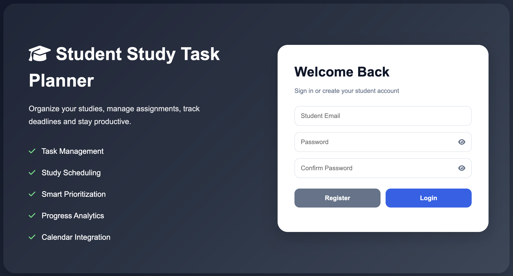
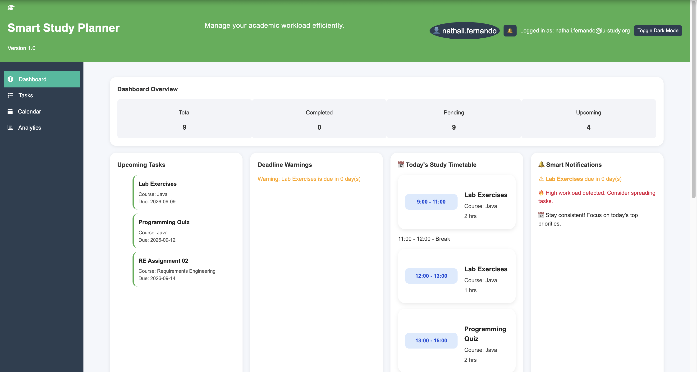
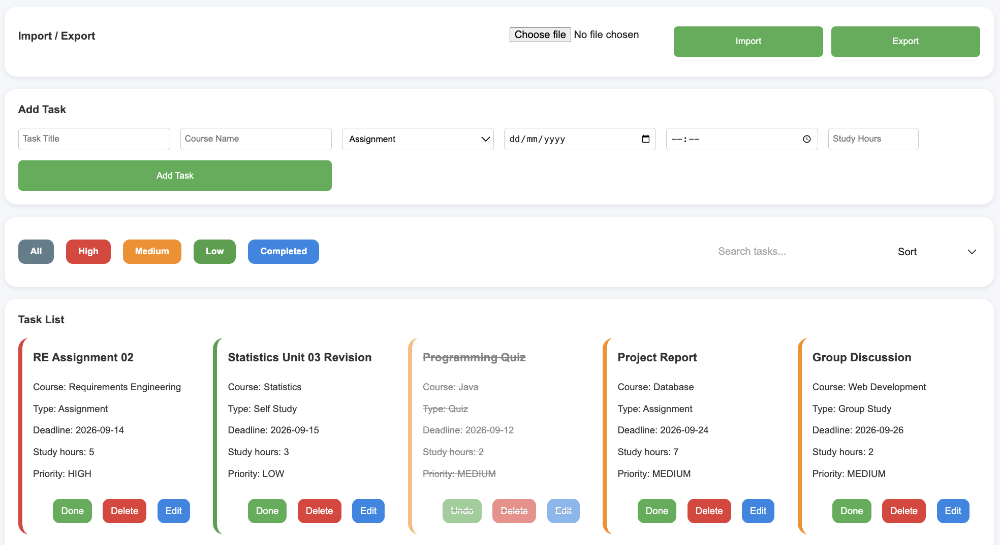
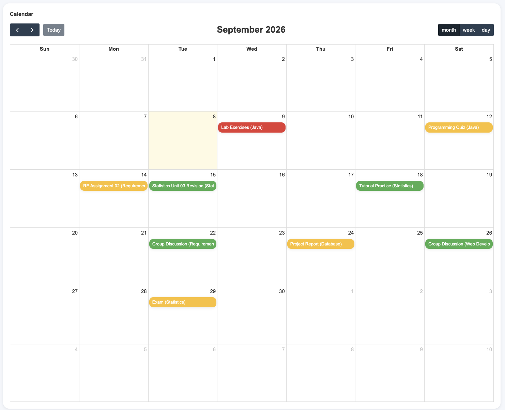
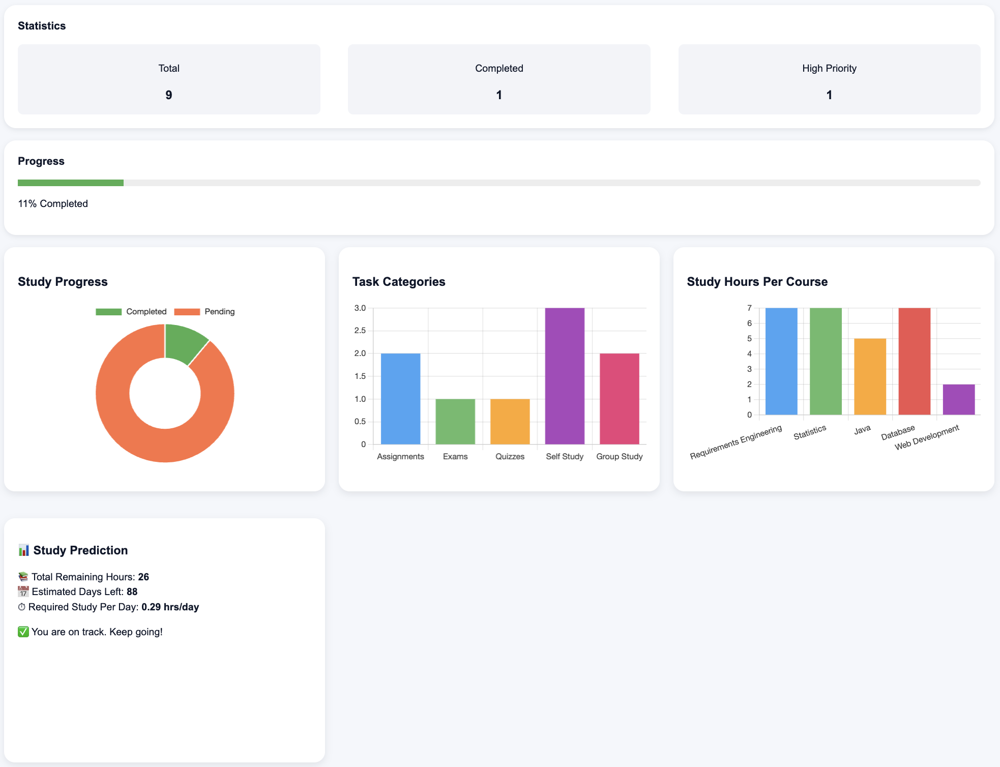
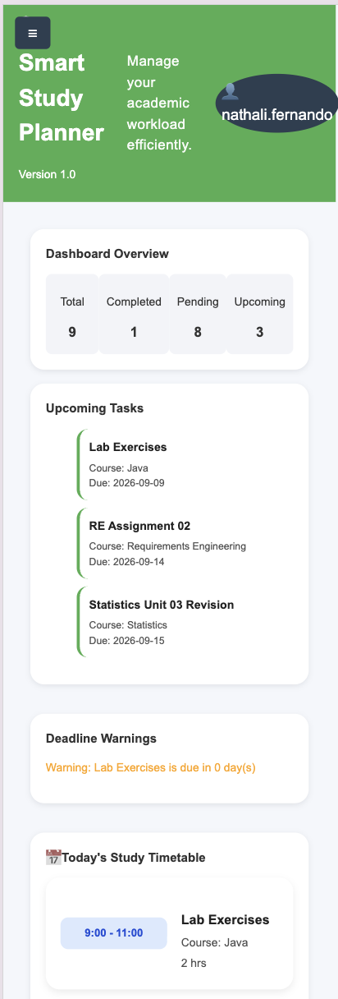

# 🎓 Student Study Task Planner

## Project Overview

The Student Study Task Planner is a responsive web application designed to help students organise and manage their academic study tasks.

Users can create, view, edit and delete study tasks and monitor their workload through dashboard statistics, progress indicators, charts, filtering, calendar functionality and study planning features.
The application enables users to manage assignments, exams, quizzes, and study sessions while providing smart scheduling, analytics, deadline tracking, and productivity insights.

---

## Live Demo

The frontend interface is available through GitHub Pages:

https://github.com/NathaliFernando/Student_Study_Task_Planner

The full application requires the Spring Boot backend to be run locally. Follow the installation and run instructions below.

---

## Screenshots

### Login & Registration



### Dashboard



### Task Management



### Calendar



### Analytics



### Responsive Mobile View



---


---

## Features

## Main Features

* Create study tasks
* View study tasks
* Edit study tasks
* Delete study tasks
* Task priority calculation
* Task status management
* Deadline management
* Study-hour estimation
* Dashboard statistics
* Progress tracking
* Charts and analytics
* Calendar view
* Search and filtering
* Responsive desktop, tablet and mobile layouts
* Dark mode
* CSV import/export

### User Authentication
- User registration
- User login and logout
- Session persistence

### Task Management
- Add study tasks
- Edit existing tasks
- Delete tasks
- Mark tasks as completed
- Automatic priority calculation
- Search tasks
- Sort by deadline
- Filter by priority and completion status

### Planning & Scheduling
- Interactive calendar
- Weekly study plan
- Daily study timetable
- Upcoming tasks section
- Deadline warnings

### Analytics Dashboard
- Study progress chart
- Task category chart
- Study hours per course chart
- Progress tracking
- Smart insights
- Study workload prediction

### Smart Features
- Browser notifications
- Deadline reminders
- Smart notifications panel
- Dark mode
- Responsive user interface

### Data Management
- Import tasks from CSV
- Export tasks to CSV
- Persistent task storage using H2 database

---

## Technologies

### Frontend

* HTML5
* CSS3
* JavaScript
* Chart.js
* FullCalendar
* Font Awesome

### Backend

* Java
* Spring Boot
* Spring Data JPA
* Hibernate
* H2 Database
* Maven

## Data Storage

Task data is stored by the Spring Boot backend in the H2 file-based database using Spring Data JPA and Hibernate.

Browser LocalStorage is used for frontend-related information such as the current user session, theme preferences and notification information.

This means task data is handled by the backend/database, while selected frontend and session information remains browser-based.

---

## Task Data Model

Each task is represented by the following fields:

`title` - Name of the academic task
`course` - Course associated with the task
`taskType` - Type of task, such as assignment, exam, quiz or self-study
`deadline` - Due date of the task
`estimatedStudyHours` - Estimated study time required
`priority` - Priority level calculated from task information
`status` - Current task status, such as pending or completed

The `Task` entity is managed by the Spring Boot backend using Spring Data JPA and Hibernate and is persisted in the H2 database.

---

## Backend API

The application provides a REST API for task management.

The REST API is exposed by the Spring Boot backend at:

http://localhost:8080/api/tasks

Get all tasks - GET `/api/tasks` - Retrieve all tasks 

Get one task - GET `/api/tasks/{id}` - Retrieve one task

Create a task - POST `/api/tasks` - Create a task

Update a task - PUT `/api/tasks/{id}` - Update a task

Delete a task - DELETE `/api/tasks/{id}` - Delete a task

## Database

The project uses an H2 file-based database for persistent task storage.

Task data is persisted by the Spring Boot backend using Spring Data JPA and Hibernate. This allows tasks to remain available after page refreshes and Spring Boot restarts.

## Testing

Testing was performed during development using the web application and direct REST API requests with `curl`.

The following areas were tested:

- Task creation
- Task retrieval
- Task updating
- Task deletion
- Invalid task ID handling
- Database persistence
- Frontend-to-backend communication
- Task loading from the backend
- Responsive layouts
- Dashboard analytics

---

## 📂 Project Structure

Student_Study_Task_Planner/
│
├── README.md
│
├── backend/
│   ├── pom.xml
│   └── src/
│       └── main/
│           ├── java/
│           │   └── com/
│           │       └── studentplanner/
│           │           ├── config/
│           │           │   └── StudentStudyTaskPlannerApplication.java
│           │           │
│           │           └── task/
│           │               ├── Task.java
│           │               ├── TaskController.java
│           │               ├── TaskRepository.java
│           │               └── TaskService.java
│           │
│           └── resources/
│               └── application.properties
│
└── frontend/
    ├── analytics.js
    ├── api.js
    ├── app.js
    ├── auth.js
    ├── calendar.js
    ├── dashboard.html
    ├── dashboard.js
    ├── index.html
    ├── login.js
    ├── notifications.js
    ├── styles.css
    ├── tasks.js
    └── utils.js

---

## ▶️ How to Run the Project

### Prerequisites

The following are required:

- Java JDK 21 or later
- Apache Maven
- A modern web browser
- Visual Studio Code or another code editor
- A local web server for serving the frontend (for example, VS Code Live Server)

### 1. Start the backend

Open a terminal and navigate to the project folder:

git clone https://github.com/NathaliFernando/Student_Study_Task_Planner.git
cd Student_Study_Task_Planner

Start the Spring Boot backend:

```mvn -f backend/pom.xml spring-boot:run```

Keep this terminal running while using the application.

The backend runs on:

http://localhost:8080

The task REST API is available at:

http://localhost:8080/api/tasks

### 2. Start the frontend

Open the project folder in Visual Studio Code.

Open the `frontend` folder and launch `index.html` using the Live Server extension.

The application will normally open at:

http://127.0.0.1:5500/frontend/index.html

The application starts at the login/registration page. After successful login, the user is redirected to the dashboard.

### 3. Use the application

Register a new account or log in.

The application's frontend communicates with the Spring Boot backend through the REST API for task management.

Tasks are stored in the H2 file-based database and therefore persist across page refreshes and Spring Boot restarts.

### Important

The Spring Boot backend must remain running while using the application.

If the backend is stopped, the frontend cannot load, create, update, or delete tasks because the REST API is unavailable.

--

## Troubleshooting

### Backend does not start

Check that Java 21 and Maven are installed:

```bash
java -version
mvn -version
```
The backend must be running before using task-management functionality.

### Frontend cannot load tasks

Make sure the Spring Boot backend is running on:
http://localhost:8080

Then reload the frontend.

### Port 8080 is already in use

Stop the application currently using port 8080 and restart the Spring Boot backend.

### Frontend opens incorrectly

Make sure the frontend is being served through a local web server such as Live Server rather than opening the HTML files directly with a file:// URL.

---

## 📸 Application Modules

- Login & Registration
- Dashboard
- Task Management
- Calendar
- Analytics
- Notifications
- Dark Mode

---

## Development Process

The project was developed iteratively. The initial frontend concept was refined during implementation, followed by the development of a Java Spring Boot backend and persistent database storage.

Testing and debugging were performed throughout development using browser developer tools, Live Server, Maven and curl.

---

## 👨‍💻 Author

**Fernando Nathali**

Developed as part of the **Java & Web Development** module.

© 2026